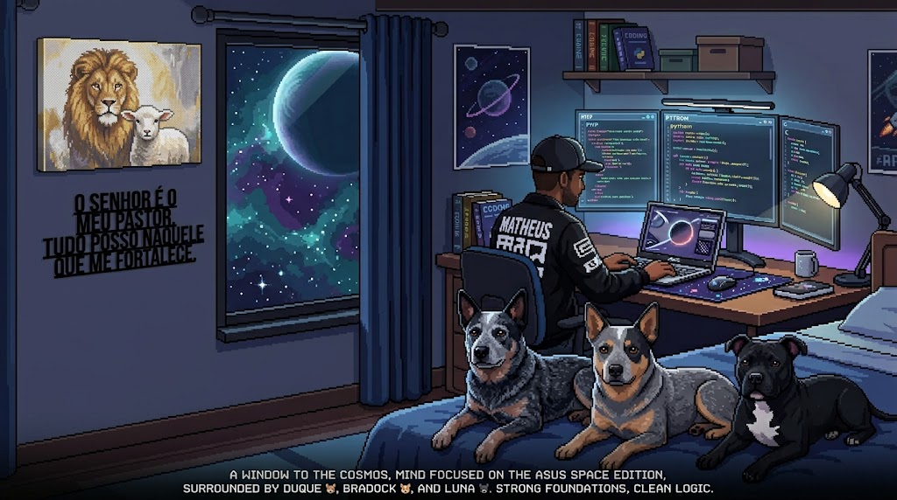

# 🌌 Matheus Ferreira
### Software Developer & Game Developer
> "Somewhere, something incredible is waiting to be compiled." — Adapted from Carl Sagan.

  
  

---

### ⚡ About Me

> "Since 1998 seeking new knowledge." — Matheus Ferreira.

I am a software developer dedicated to crafting robust backend architectures, efficient integration logic, and seamless game development. Guided by a philosophy of high independence between components and clean, self-explanatory code, I aim to build systems that are accessible, lightweight, and inspiring. My ultimate goal is to leverage technology to create efficient and open-source solutions that empower everyone.

- 💼 **Current Role:** Software Developer (Retail Integration) at **Teknisa**, designing complex system communications.
- 🎓 **Education:** Computer Engineering Student at **CEFET-MG**.
- 🚀 **Purpose:** Open-source enthusiast and creator of **NativeZipTools**.
- 🎮 **Background:** Co-developer and project planner of *Bubble* (officially released on Google Play) at **Commit Jr**.

---

### 🛠️ Core Stack & Technologies

<table border="0">
  <tr>
    <td valign="top" width="50%">
      <strong>🧠 Core Languages</strong> 
      • <code>PHP</code> (Slim, Symfony, Doctrine) 
      • <code>Python</code> 
      • <code>C / C++</code> 
      • <code>C#</code> | <code>Java</code> | <code>JavaScript</code>
    </td>
    <td valign="top" width="50%">
      <strong>🗄️ Databases & Cache</strong> 
      • <code>MongoDB</code> 
      • <code>Oracle SQL</code> 
      • <code>SQL Server</code> | <code>MySQL</code> 
      • <code>Redis</code>
    </td>
  </tr>
  <tr>
    <td valign="top" width="50%">
      <strong>🔌 Protocols & Techniques</strong> 
      • <code>Webhooks</code> 
      • <code>Websockets</code> 
      • <code>Pooling</code>  
      • <code>REST APIs</code>
    </td>
    <td valign="top" width="50%">
      <strong>🏛️ Architecture & Patterns</strong> 
      • <code>SOLID</code> | <code>Clean Code</code> 
      • Microservices Architecture 
      • Agile Methodologies (<code>Scrum</code>)
    </td>
  </tr>
</table>

---

### 📊 Metrics & Activity

  
  

---

### 🎨 My Universe (The Setup)

  

  <em>A window to the cosmos, mind focused on the Asus Space Edition, surrounded by Duque 🐕, Bradock 🐕, and Luna 🐕. Strong foundations, clean logic.</em>

